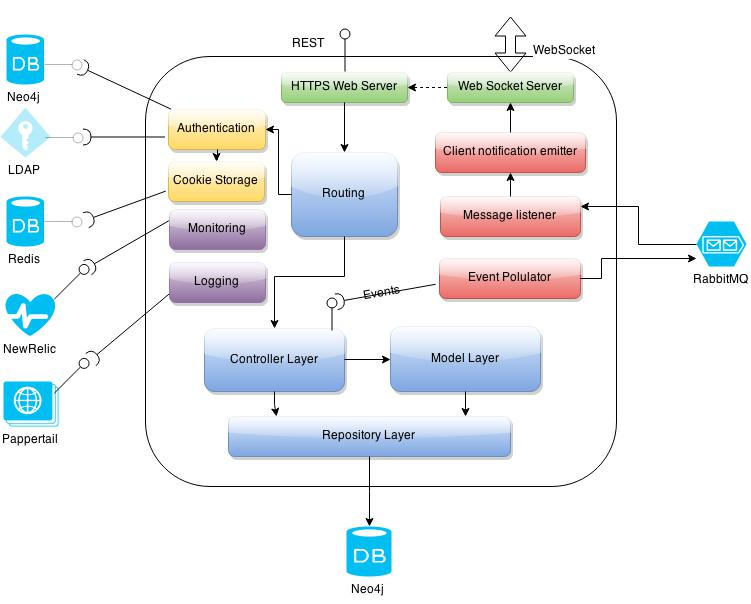
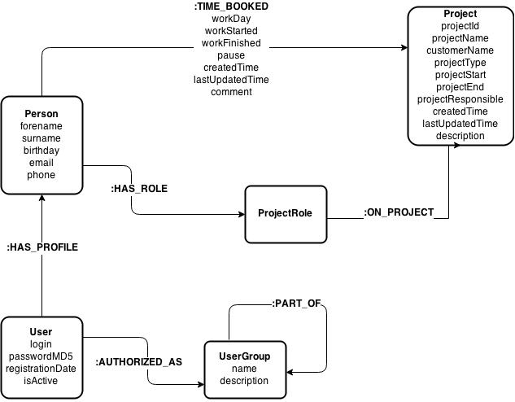

# Architecture overview about Timetracker implementation

## Architececture of the system (Wie ist die Architektur des Gesamtsystems?)

Timetracker consists of two parts: Client and server which communicate with each other only over HTTP / Web Sockets
The architecture of the client is described in its git repository. Here we are going to speak about the server part.

### Authentification
Authentication is made with "Passport" - popular authentification library.
Passport handle authentication request according to the included and configured authentification strategy. It also implements serialization and deserialization of the current used information needed in the application logic.
If a request is recieved and there is a session for it in redis store, passport deserialization uses programmed logic to resolve user information and provide it for the application as described.
Currently implementation uses Neo4j database for user persistance. Passport allows modules to implement a lot of other kind of authentications like LDAP, OAuth, Facebook, Google etc.

### Cookie Storage
Cookie storage is a central place where the information about authenticated sessions is stored. Current implementation uses Redis to be cluster ready. It also means that if the server is restarted, the used do not need to repeat his authentication because its data is stored externally by redis. More information about redis can be taken from Redis.com.
Cookie Store is configured as a middleware and is called by every request to retrieve session state.

### Monitoring
Timetracker uses new relic to monitore it state and functional metrics. New relic module is included to express as a middleware and observes the application state.
All accumulated information is sent to the newrelic api and processed there. All technical oriented data like rest paths called and occured exceptions are transfered automatically and transparently to the implementation.
New Relic gives also the possibility to monitore business events. Such events are custom data and need to be sent manually using provided api.
Such event messages are sent by timetracker from the model layer. Such business activities as booking created or updated etc. are explicitly sent to new relic.
It is also possible to visualize this events in new relic using provided NSQL language queries to create dashboard data and visualization.

### Logging
Loggin is processed central and is stored locally as well as sent to the Pappertail service (as far it is deployed on heroku) to allow logs persisting and queries.

### Web Server
As already mentioned on the skill overview, the server is implemented within Express framework, which is lightweight modular construct to create performant nodejs applications.
Express connects architecture parts with each other and controlls (process) web requests.
Express web service component plays as a listening web service that can recieve request and give to the configured middleware chain.
The chain contains many services and utilities beginning from cookie parser and ending with exception handling.

### Web Socket Server
Web Socket technology is used to provide a possibility to push notifications to client and inform it about some eventually important changes that can trigger a need for part data refresh.

Current implementation uses Socket.io nodejs plugin. It uses Web Server connection to realisze Web Socket communication and avoid firewall and port issues.
Web Socket is technical component that is used by other server components to emit notifications on currenty listening clients on this server.

### Client notification emitter
Client notification emitted handles messages from message lestener emitting them to the client via WebSocket over Web Socket Server.
Every node in the cluster is responsible to for it currently connected clients. JMS Communication gives a possibility to inform every node of cluster and let it inform his connected clients.
Optionally there can be one single client notification emitter on cluster which communicates with all clients customers. It can become bottleneck and need to be evaluated according to the service requirements.

### Routing
Routing component controlles requested url path and route request to the correct handler chain. 
It uses middleware chain to intercept requests and log/authorize them. This is a key component that "knows" which components need to be called to process requests.

### Message listener
Message listener component has only one function: it listens on the JMS Queue (RabbitMQ) and recieve messages from it if any. It can validate them and route it ahead to the client notification component for notification emmiting.

### Event Populator
Event populacor component is one of the key compoents by the handling of client push notification requirements. 
It listenes on the business events comming from the controllers and populate them to the RabbitMQ Messaging service, where all cluster nodes become information about the business event.
It wrapps logic to listen on business events as well as connection to the JMS which is configured to be used for event population.

### Controller Layer
Controller layer is responsible to analyze recieved business request, prepare technical request on the repository or a model and handle its answer. 
It is also used to analyze business data recieved from repository and generate visualization data model. 
Some of controllers extending EventEmitter interface and throw local js events on business actions that can be listened by other components like Event Populator

### Model Layer
Model Layer wrappes complex business object and provide a api to access them. It implements business validation rules and handles business logic of their managed objects.
Single model call can take use of multiple repository requests to process a result.

### Repository Layer
Repository layer wrappes the database communication and handle databse responses. It uses prepared statements as well as neo4j lib API to communication with REST API of neo4j.
It provides methods for different access levels, like admin methods or self administration. This separation can be taken from the jsDoc.

## Security implementation (Wie funktioniert die Security)
Security is implemented by passport and redis session store as middleware of the express framework. As mentioned above it is currently neo4j based. 

### Authentication
There are two authenticated strategies: local and localsign. Local strategy authenticates user over security controller. It takes userlogin and password and calls security service to check it. If ok, it saves user id serialized  data encrypted in the session.
Localsign is used by the user registration. It takes all given signup data, and tests if username is unique and stores a new user to the database.

### Authorization
The are three user roles that are implemented: User, Manager and Administrator. There is also a fallback mechanist that is configured to make someone User and Manager if it has a admin level role as well as user if it is manager.
It makes easier to level the access rights. This can be easily changed on the neo4j database.

Router component handles a checking of authorization by service access. There are currently some services that can be accessed only by the administrators like password reset for a concrete user.

## Persistence 

Neo4J is used as a business data storage. Graph database provides a possibility to handle the business data as a graph. It is near to read world abstraction and allowes to handle real world queries easily.
Business Model is modelled as a graph of nodes and relations between them. Nodes are typed by labels what makes querying easier.
Here is a briefly description of some of importan nodes and relations.

### Person
Stores basic person information. 
It is a physical person - employee of a company that may or may not be a user (it it has or was cancelled). The separation between user and person is important because of the reason above.
Person can have a relation to the ProjectRole on some project. Person may also have booked time on the project.

### User
User is a entity that represents a user, that can login. it stores user account information like encrypted password, and other login information.

### Project
Project describes a project statical information like descriptions start and end date and so on. 
It can be referenced by person by relation named "TIME_BOOKED" and by Project Role by "ON_PROJECT"

### TIME_BOOKED
This relation represent the actual time booking of a person on a project. One person can have a lot of bookings for a project. 
The only restriction is that the booking times cannot be overlapped. It is not allowed by requirements that person can book same period of time
on multiple projects.

### ProjectRole
Project Role is a node that represent roles in a single project. Projecdt Role is automatically created as someone is assigned to the project on the role.
Future feature: In a future it gives a possibility to assign multiple people on the same project role in different time periods. 
For example Person A was Architect of a Project B from 01.01.15 till 01.04.15 and Person B from 01.04.15 till today. 

### ON_PROJECT
Relates project role and a project. Can be also extended with information about history roles. It can be usefull by long term projects.

### HAS_ROLE
Relates Person to the occupied project role. Can be extended with time and other information to cover extended requirements.

### User Group
Group is a composite construct, that allow to create complex authorization models in the future. Actually it is simply used to say that Admin is also Manager and User, 
and Manager has also User permissions. It can be extended with Teamleads and other company specifically staff.
