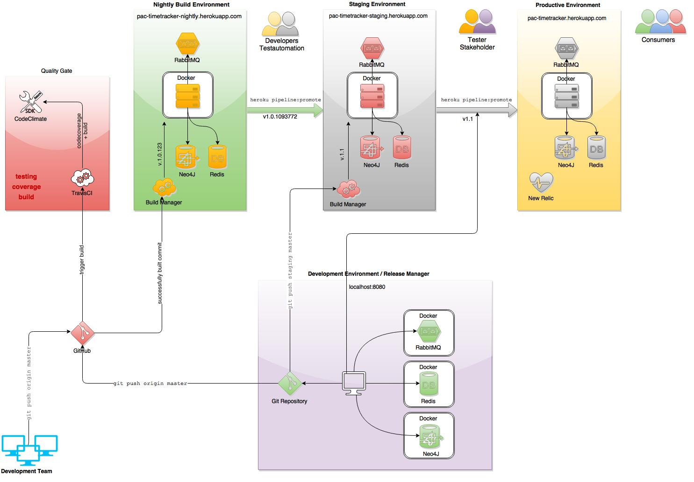
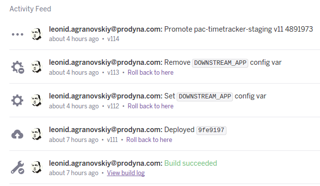
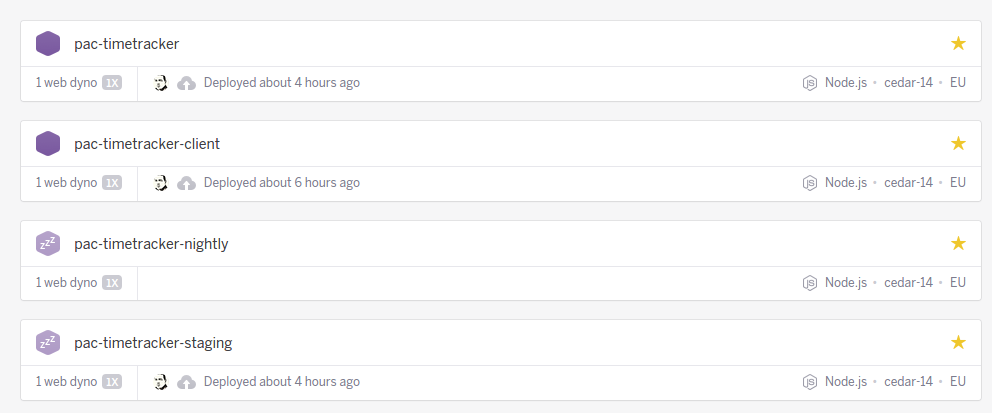

# Build & Release
In the following page you will find information about build and release of timetracker application.

Overview about build and release management

## Information about release units (Welche Release Units gibt es?)

There are two release units: timetracker-client and timetracker server.

## Explanation of building process (Wie funktioniert der Build?)

There are two building processes in work: Quality Gate + Release Management Gate.

### Quality Gate

Quality gate build target is to ensure tests are running and no rules are broken like syntax, codecoverage etc.
This Build is processed by travis ci. It is informed by every pushed commit and triggers the build automatically.
The build process consist on following build steps:

 * jshint 
 
     Analyse code if every js file matches code style requirements defined before
   
 * clean
 
    Clean working directory
    
 * instrument
 
    Prepare code by copying and enhancing it in the instrument folder to process code coverage analyse
    
 * test
 
     Run application test and collect coverage information
    
 * storeCoverage
 
    Save collected coverage information in a lcov format
     
 * makeReport
 
    Fetch saved lcov data and create human readable code coverage report
    
 * codeclimate
 
    Transfer lcov data to the codeclimate to mess quality of the product
    
### Release Management Gate
    
Release management gate happens in heroku PAAS. As far Quality gate is passed, heroku build manager takes the sources and creates a docker image with version.
This image will be historized for rollback. If build is succeded, heroku stops old and starts a new container containing the newest version of the application.


## Explanation about deployment process (Wie funktioniert das Deployment?)

Timetracker is based on heroku pipeline concept supported by git workflow. We define 3 release stages of the development: nightly, staging and productive.
Ofcause we can add more of them if we need. Here is a description of process behind of every of them.

Heroku pipeline defines which way docker images will be moved. Timetracker pipeline is simple:
<code>pac-timetracker-nightly -> pac-timetracker-staging -> pac-timetracker</code>
It means that we say <code>pipeline:promote</code> on nightly, it will transfer image to staging, and if we say the same on staging, it would bring it to productive env.

### Nightly Build Environment Deployment

The target of this stage is to give a real time state of the source repository. Developers and other project participants can look every time to the current development state.
It is easier to see which comit broke some important features by rolling it back. Also this stage is a good place to run automated ui tests. 
This environment is 100% fork of the productive environment and gives also a benefit to see if the application would work on prod.

Every commit leads to a new snapshot release. After any code is commited, github informes configured applications about new commit.
Travis CI pulls the actual sources and execute tests. It all tests are green, than quality ensurance process starts.
This process is serviced by code climate service. It analyzes the code on duplicates, known anti-patterns etc. It also collects information from travis ci test result to get a testcoverage value.
Both services (travisci and codeclimate) have a possibility to fail build/alert someone if something is wrong. It is actually not configured.
If all is ok, the heroku platform is informed about successful build. It pulls sources from github and creates a docker container to run the application version.
As far as container is ready it is stored in the version history of heroku and can be simply recovered. It is a documented release artifact.

### Staging Environment Deployment

Staging area is used to represenc release candidates for productive environments. It can be used to be tested by non dev team and reviewed by project stakeholders.
It is also 100% fork of the productive environment.

There are two ways a new release can go to staging area: by the release manager accepting nightly build and promoting it to staging area, or by lead developer / release manager throw pushing of a concrete branch/tag/state to the staging git repository.

#### Release Manager way

Release manager can decide he want to release a currently nightly build on staging area. Than he only need to say <code>heroku pipeline:promote</code> on the nightly build repository. 
This command would simply take the built docker image with latest version and copy it to the staging area.

#### Branch/Tag/State push 

As far as a release manager want to build a tag version, he is also able and allowed to create a git tag and push it directly to the staging area <code>git push staging release_1.0</code>.
Build Manager of staging area will create a docker image for the version and run it.
After release candidate is tested and approved, it can be simply moved to the productive by saying <code>heroku pipeline:promote</code>

### Productive Environment Deployment
Productive environment has no build manager configured. The only way new version can be deployed here is over the staging area as discribed below.
Productive instance has only a few differences to other staging, for example it has a few plugins extra, that have no impact on the application running, like monitoring over new relic.

## Git Release process description (Wie erfolgt ein Release?)

Release is made as a normal build with only difference that a trigger for the build is a remote git tag.
Tag has a name in following format: Release_<Version>

```
git add .
git commit -am "Release <Version>"
git push
git tag Release_<Version>
git push origin Release_<Version>_rc1
// or respectively:
git push staging Release_<Version>_alpha
```

## Explanation of artifacts (Welche Artefakte existieren, welches Format haben sie und wo sind sie zu finden?)


The main artifact repository is heroku version system mentioned above. 