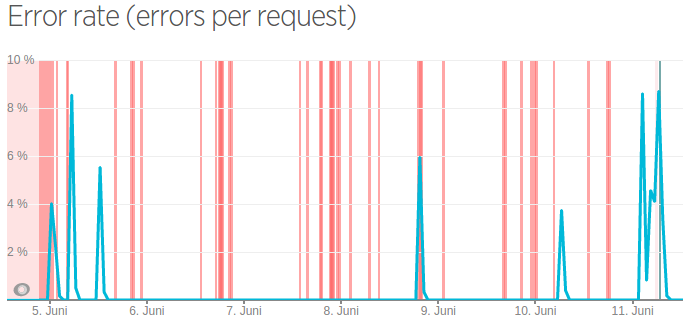
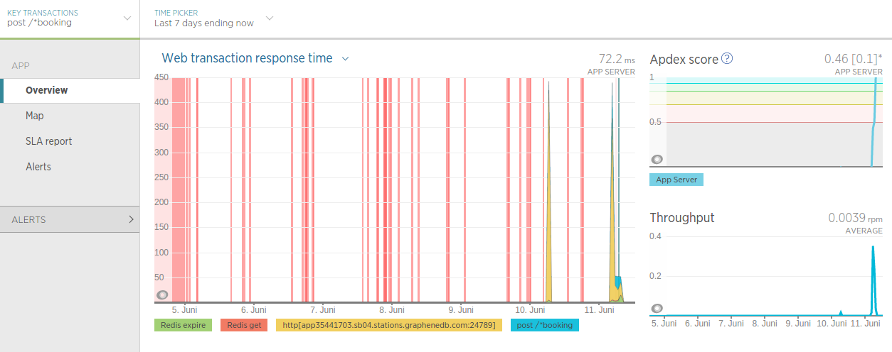
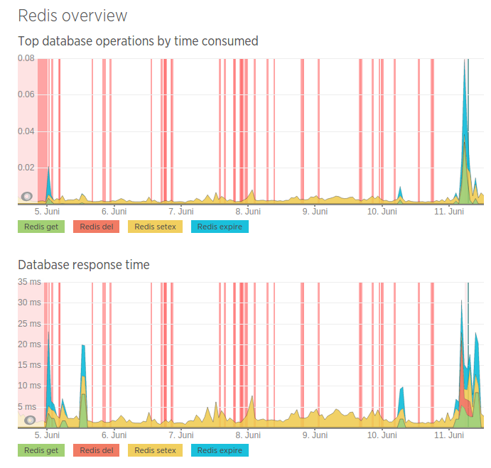
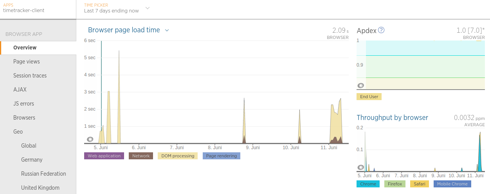
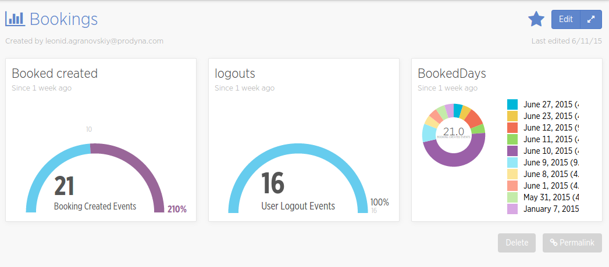
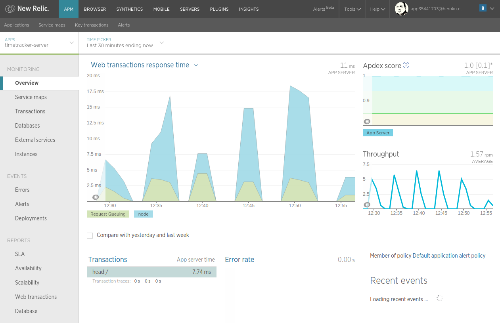

# Monitoring timetracker application

The monitoring of application is made on multiple channels: active, passive and log analysis.

## Active monitoring

This part of monitoring is handled by [newrelic](newrelic.com) - cloud monitoring solution.
Active monitoring is made using newrelic plugin installed in the application. It sends dynamical information about error, transactions etc.
It is also used to visualize actively sent application event feed. Such activities as booking creation/change, project creation etc 
produce events that are stored in the monitoring and can be visualized, monitored and used to define application running policies.

Actually both server and client send usage information to new relic. It make it possible to analyse and controll perfomance and early detect errors.

### Error rate monitoring

Every exception or error thrown in the application is accumulated by newrelic. It influence the user satisfaction index APDEX and is a part of application policy.
APDEX is used to get a relative value of user satisfaction containing throughput, response time, toleration index which include error rates in time.

### Key Transactions

New relic gives also a possibility to separate key transaction data from the other data collected. For example we have configured that all operations
on the booking POST resource are our key transaction and become a separated evaluation metrics about this calls. It gives us a flexibility to react on special events.

### DB Transactions

New Relic collectis also usage data of the redis and neo4j databases. It can be helpful to analyse a bottleneck and speed up application.

### Browser statistics

Timetracker client is also monitored and save a lot of information about js errors, communication problems, timeouts and responces etc.

### Subject monitoring

The last and main part of the monitoring is a subject data. This data is actively sent by the application and represent some user action like booking or project creation.
New Relic Insight give us a possibility to analyse this subject events, react on them and visualize them.

## Passive monitoring

Passive monitoring is data that is collected without need of application to send something specifical to the monitoring system.
New relic pings application every xx seconds and analysis response times from different world parts as well as availability.

## Log analysis
Is handled by [Pappertail](pappertail.com) - cloud solution for persisting and analyzing of logs produced by the application.
Logs are persisted their. Using some kind of regex we can define pappertail events, that can cause some kind of stakeholder notification.
For example if we find the word HackingAttempDetected exception in logs more that 3 times in 5 minutes we can send email, or post twitter message, that someone is hacking our server.
Actually no events are configured. They need to be defined first by the customer.